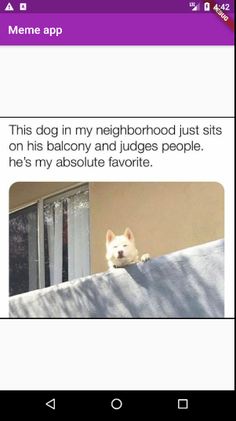

# MemeApp

A very simple prototype of a meme app built with Flutter. It pulls memes from https://meme-api.herokuapp.com/gimme. Tapping shows the next meme while a tap and hold goes back to the previous one.

